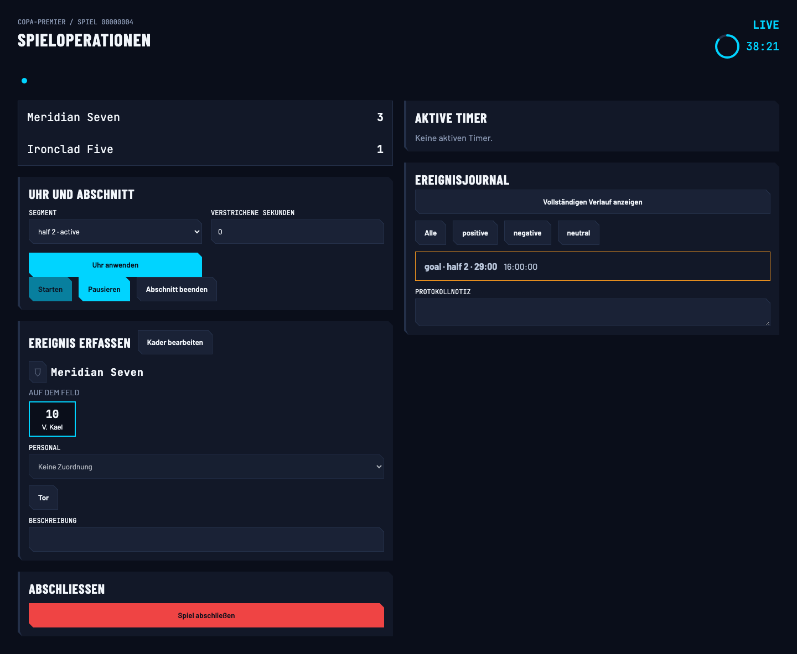
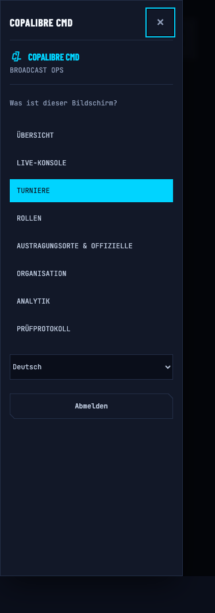

# Operator screen workbench — OpenSpec 0216

## Scope and fixtures

The workbench renders production components, not replicas of the marketing illustrations.
Brand changes belong to 0217 and operational parity patterns to 0220. This change supplies the
screen review surface those changes need.

47 sibling story files cover operator routes, presentational screens, and their fragments.
The original proposal's “58 screens / 36 needing clients” conflated exported components, wrappers,
and fragments: the current non-library directory contains 55 source files. Only Dashboard and
ControlShell needed a new optional ControlApiClient prop; DashboardRoute forwards its existing client
through both. No new endpoint, routing framework, auth fixture, or shared comprehensive client exists.

Shared identities use UUIDv7 IDs and kebab-case aliases. Meridian Seven, Ironclad Five, Echo Squadron,
Copa Premier and V. Kael mirror the reference examples. Discipline-specific console labels and
behavior remain projection data. The paused match has a stable elapsed clock, not a fabricated
real-time subscription. A scheduled match is the empty console state; LoadMatchData's empty mode
is denied capability, not an impossible match without participants.

Each route owns its read stub. Missing methods throw; explicit undefined means an optional capability
is absent. These are visual review fixtures, not a complete interactive backend. Arbitrary mutations
outside a named workflow deliberately fail rather than pretending to persist. Named workflow stories
drive the actual controls for import committing, schedule conflicts, and the narrow navigation drawer.
The import response says “committing”; it does not invent a per-row progress field absent from the API.

The existing language catalogues, ToastProvider and control-density decorator are reused.
Screen stories additionally use the existing standalone `cl-control-screen` containment scope,
matching wrapping/minimum-size rules they inherit from the real shell's main column. This is not
the `cl-control` sidebar grid and introduces no new provider.
Shell-owning stories set the isolated Storybook origin's stored language before mounting because the
real shell owns its own IntlProvider. No access token or personal credential is seeded.

## Original 0216 deferred source files

This table records the 0216 boundary. Change 0222 subsequently added stories for
`AcceptInvitationForm`, `AcceptInvitationScreen` and `PreferencesRoute` and removed the opt-in
coverage register. Current coverage recursively includes operator, public and TV React surfaces;
see the [0222 follow-up review](reviews/0222-owned-control-coverage.md).

| Source                     | Reason                                                                                                                                                                                                          |
| -------------------------- | --------------------------------------------------------------------------------------------------------------------------------------------------------------------------------------------------------------- |
| ControlApp.tsx             | Session bootstrap and auth routing; a leaf story cannot represent authentication or redirect behavior.                                                                                                          |
| ControlRoutes.tsx          | URL-driven route composition; covered leaves and actual navigation e2e tests remain the useful surfaces.                                                                                                        |
| ControlOrNotFound.tsx      | Session/routing guard rather than a distinct screen.                                                                                                                                                            |
| ToastProvider.tsx          | Already mounted by the workbench decorator; not a screen.                                                                                                                                                       |
| NativeAuthRoutes.tsx       | Login, recovery and reset use raw auth fetches, token writes and redirects, not ControlApiClient. A safe interactive story needs an auth transport/navigation seam outside 0216's client-only production scope. |
| AcceptInvitationForm.tsx   | Raw auth mutation and navigation; same boundary as native auth.                                                                                                                                                 |
| AcceptInvitationScreen.tsx | Composes AcceptInvitationForm, inheriting that boundary.                                                                                                                                                        |
| PreferencesRoute.tsx       | Organization reads accept a client, but PAT load/create/revoke bypass it using raw fetch. A client-only story would still reach live auth endpoints.                                                            |

Do not add fake auth data or override global fetch to hide these dependencies. Keep them outside the
story coverage until an explicit seam is designed; existing real-route tests remain authoritative.

## Existing UX exposed by stories

- DashboardRoute, AnalyticsRoute and LiveConsoleRoute collapse read failures into empty results.
  Their Failed stories represent the failed request, not a distinct production error design.
- StandingsRoute has hardcoded Spanish loading/error text; ActivityLog uses English relative
  time/action presentation; RosterRoleSelector uses Spanish labels. Analytics/LiveConsole also retain
  hardcoded Spanish strings. Translate production messages under operational parity (0220), not
  fixture-only translations.
- BracketCanvas displays opaque entrant/match identifiers despite names being available on its
  containing seeding page. ScheduleBuilder and PromotionPlan similarly expose identifier-oriented
  presentation. Do not replace UUIDs with display names in identifier fields to beautify fixtures.
- RegistrationResponse has no submission timestamp or team display-name field. The route therefore
  cannot show the presentational page's complete information from that response; the story keeps
  that omission visible.
- Import confirmation currently announces success when the returned job is still committing.
  The ImportCommitting story exposes this ambiguity; a truthful job-progress UX belongs to 0220.

## Verification

Review uses the local Storybook server, generated tokens from the working tree, and real catalogues.
No screenshot baseline, hosted build, visual-diff dependency or new CI browser gate is introduced.
The first German 188px pass covered 152 story states and exposed 33 overflowing states. Several
were missing the real screen containment scope in Storybook. Production layout repairs address
fixed-column descriptor/profile steps, analytics metric cards, bracket zoom chrome, the role selector,
jersey panels, standings-distribution rows, and platform module actions without hiding content or
shrinking touch targets.

Final confirmation covered all 152 story states at 188, 374, 767 and 1440 CSS pixels in German,
plus 188px in English, Spanish, French, Portuguese, Italian, Russian and Chinese: 1,672 unique cases.
Every render completed without uncaught browser errors. The durable pass found platform module
actions overflowing in 24 cases before their wrapping fix; a separate confirmation reran all 44
platform width/language cases with zero overflow. All remaining cases also have zero page overflow.
These are local browser measurements and visual spot checks, not a new automated CI gate or a claim
of real-device testing. Dense 188px layouts still wrap heavily; brand/spacing parity remains 0220 work.

Visual inspection included desktop and 188px match operations, the 188px descriptor wizard, 374px
open navigation, and 767px schedule-conflict/import-committing states. The existing standings bar
width animation remains a detector warning; animation changes are outside this screen-story change.
The Impeccable responsive review informed the containment and wrapping fixes, preserving current tokens.

Local gates: root lint, format check, typecheck and unit suite pass; web Astro check passes;
web coverage passes (103 suites, 1,336 tests, 85.48% branches); the ownership checker and its 32 tests
pass; strict OpenSpec validation passes. Full end-to-end verification passes with one worker. The
default parallel run collided on public fixture port 3001 (`EADDRINUSE`), so it is not reported as green.
Existing unrelated token-generator working-tree edits are not part of 0216; screenshots reflect that
working tree and are review evidence, not pixel baselines.

### Review captures

