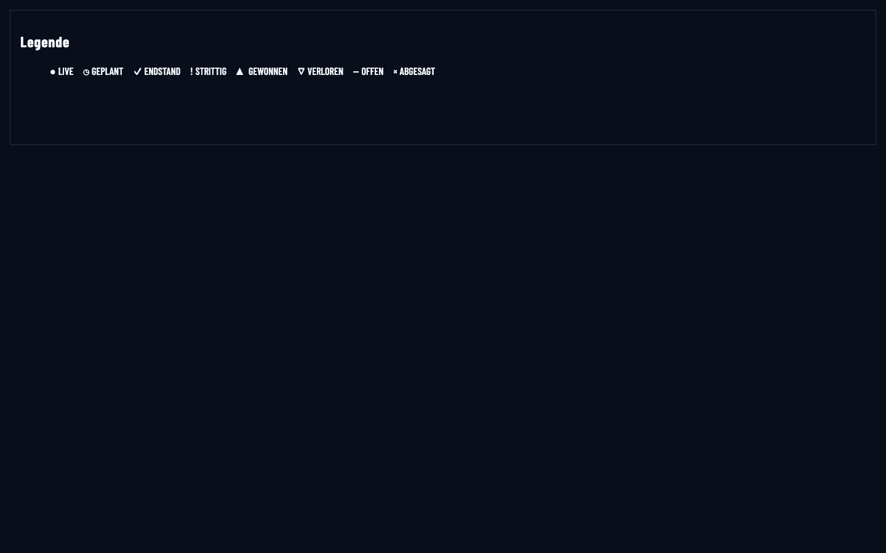
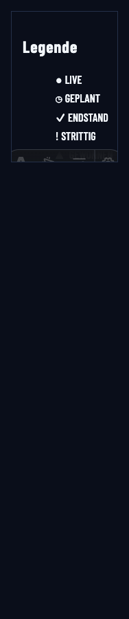
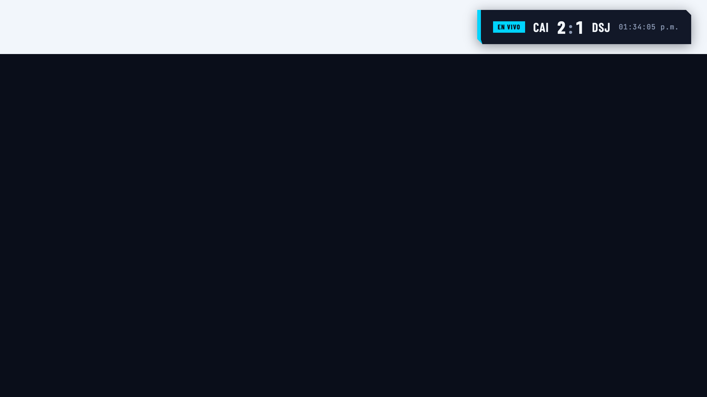
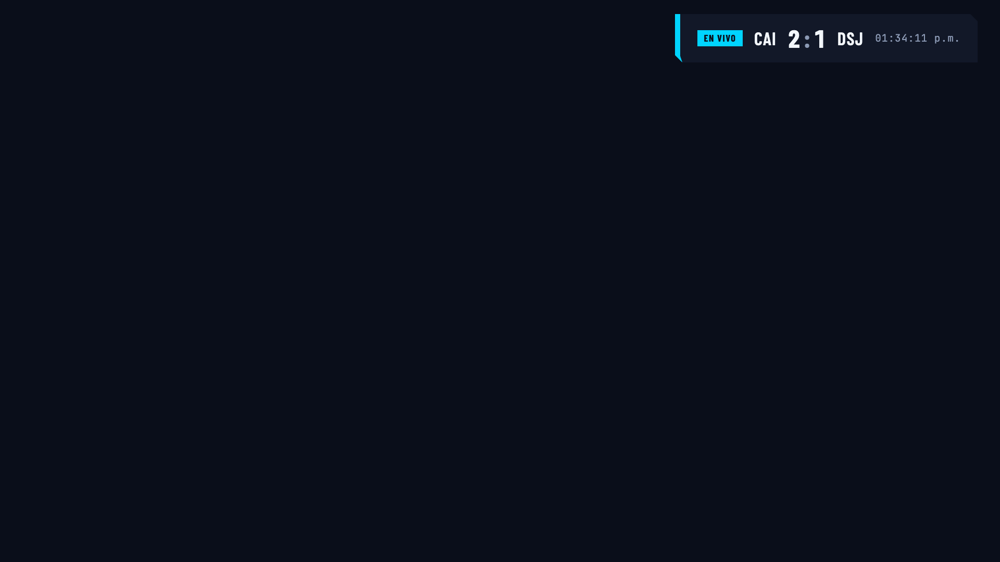

# 0220 operational surface foundations — apply review

Reviewed 2026-09-09. This change supplies the public/TV owners, calibrated tokens,
canonical review fixtures and local Astro preview that 0223 compositions consume.
It does not claim the composition parity review assigned to 0223.

## Corrections made during conclusion

- Register the preview through Astro's development integration hook, with its
  implementation outside `src/pages`. The original `__preview` directory was
  not registered: a real browser request returned the public 404 page.
- Probe preview availability through Storybook's local proxy, checking HTTP
  success and timing out after 5 seconds. An opaque `no-cors` response could not
  distinguish a preview from a 404. The iframe loads directly from Astro so its
  scoped styles and assets resolve correctly.
- Connect preview stories to the language toolbar, preserving explicit locale
  arguments; recover after changing an unavailable selection and ignore stale
  requests. Encode component identifiers as one path segment.
- Extend content alternation through wrappers and eight tested nesting levels
  using inherited style-query context. Chrome remains lifted, with borders on
  headers and footers. Band/card/well selectors remain the bounded fallback for
  browsers without style queries; automatic owner assignment belongs to 0222.
- Order calibrated button hover rules after the generic brightness filter, so
  token fills are not brightened a second time. A browser regression checks
  both primary and secondary computed hover colors and filters.
- Reset unused radii in the longhand chamfer tier, including a badge carrying
  the shared chamfer class. Update the invitation test to assert actual cut
  corners and reject clipping instead of requiring the old shorthand string.
- Add the missing best-of-five fixture and verify it through production series
  projection helpers. Standings totals and their head-to-head tie are checked
  against the six supporting matches.
- Correct contrast evidence: primary/secondary text passes 4.5:1 and essential
  indicators using `border-strong` pass 3:1 on all calibrated levels. The
  reference's muted decorative separators are not claimed as a 3:1 AA pass.

## Verification

| Gate                                 | Result                                                                    |
| ------------------------------------ | ------------------------------------------------------------------------- |
| Root unit suite                      | 4,289 tests, 307 suites passed                                            |
| Web coverage                         | 1,394 tests, 114 suites; 92.91% lines, 85.57% branches; thresholds passed |
| Design-token coverage                | 122 tests; 99.43% lines, 92% branches; thresholds passed                  |
| Lint / format / typecheck            | Passed; Astro reports 0 errors                                            |
| Ownership and scanner tests          | Passed, no increased allowance                                            |
| Forbidden tokens / integrity         | Passed                                                                    |
| Docs production build                | Passed through web build integration coverage                             |
| Full E2E                             | 223 passed, serial execution                                              |
| Infrastructure validation            | Helm/Compose parity, enterprise docs and notices passed                   |
| OpenSpec validation / test discovery | Passed                                                                    |

Run the full browser suite with `yarn test:e2e --workers=1`: several existing
fixture servers share port 3001. A parallel run encountered port collisions;
the serial run passed. Web coverage invokes `verify:docs`; run it separately
from root tests and E2E because those also build the same output directory.

The existing responsive E2E matrix exercised representative Control, public,
help and TV routes at 375/768/1024/1440 px and the 188 px effective viewport for
200% zoom on a 375 px display. New browser tests verify production preview 404s,
eight-level alternation, longhand geometry, and blocked-font login labels,
focus and overflow at 188 px. This is effective-width zoom coverage, not a claim
of manually changing browser zoom on every route.

The actual Astro legend was inspected through Storybook and directly at
1440/767/374/188 px in German. Labels remained complete without body overflow;
the narrow fixed-height story frame scrolls locally. The toolbar selected German
in the requested iframe URL and the rendered document. Unknown identifiers
returned 404 and showed the unavailable message. Barlow, Barlow Condensed and
JetBrains Mono were each loaded and confirmed through `document.fonts`.

The existing TV lower-third story was inspected at 1920×1080 with light and dark
review backgrounds. Its score scrim stayed at `surface-panel`, with readable
state text and no horizontal overflow. These captures review the production
component in its workbench; production TV routes are covered separately by E2E.






## Local review and follow-ups

Run these from the repository root in separate terminals:

```sh
yarn workspace @copalibre/web dev
yarn workspace @copalibre/web storybook
```

Storybook listens on port 6006; the Astro preview uses port 4321. Open
`Public/Astro preview` and use the language and viewport controls.

The primary role remains cyan-400; its hover is cyan-300. Live and focus roles
remain unchanged. Content alternates between ink-950 and ink-900; chrome uses
ink-850. Opaque rows use ink-930 and ink-940. Badge left-pair cuts deliberately
diverge from the reference's square badge.

`surface-chrome` and selected/raised surfaces currently share ink-850. Change
0222 owns their separation and automatic level assignment. Change 0223 owns
composition adoption, its reference index and the batched visual parity review.
No database migration, API contract, persistence behavior or release configuration
changes are required. Existing CI jobs discover the tests; full E2E remains
release-candidate gated, so retain the local result when that job is skipped.
