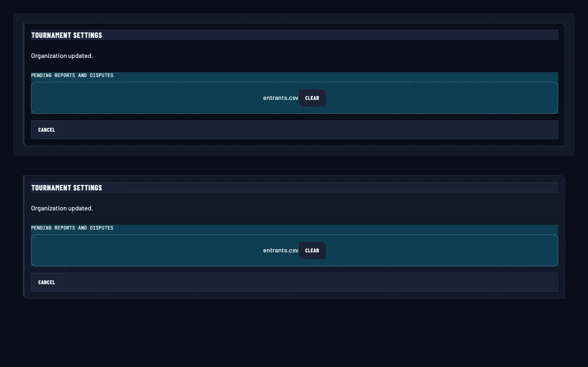
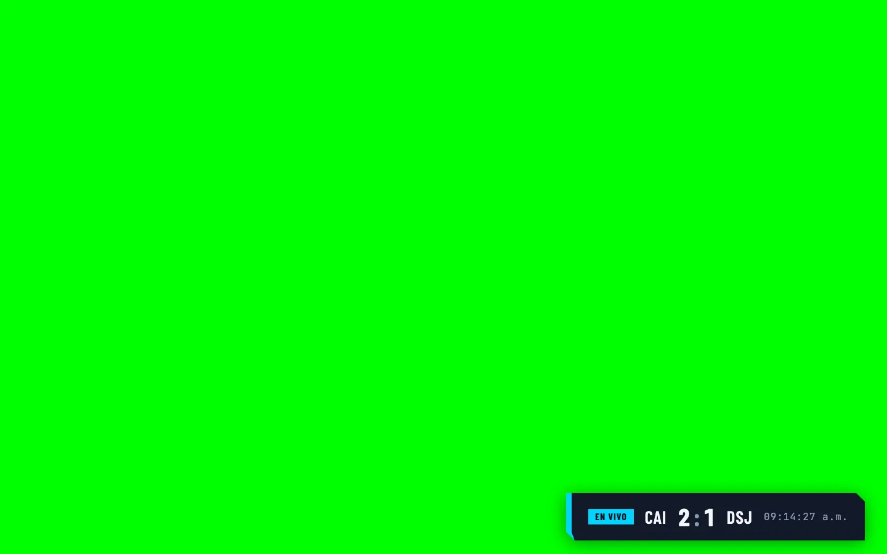
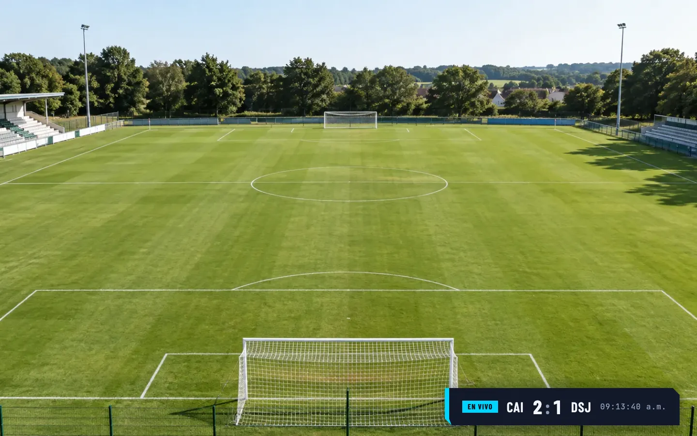
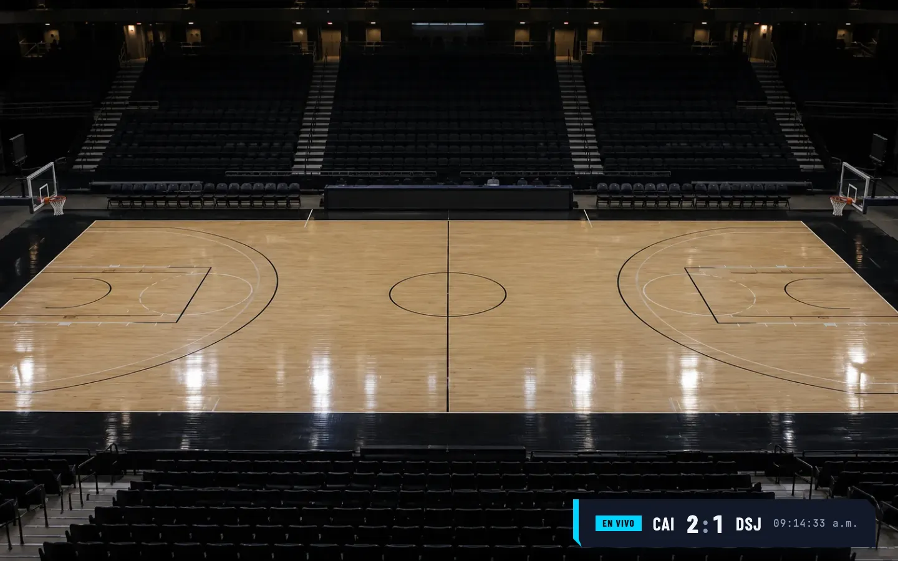
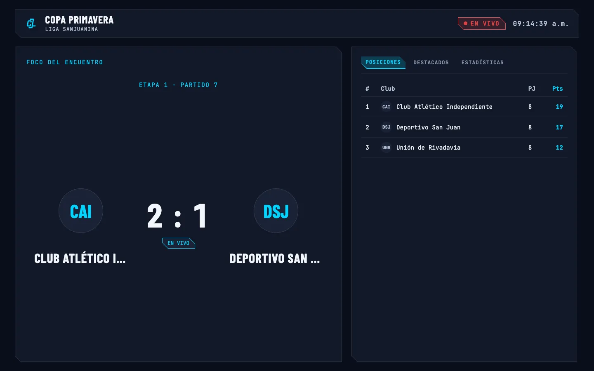
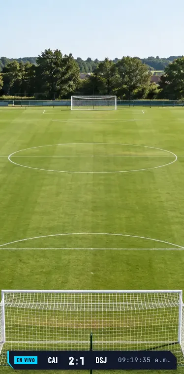
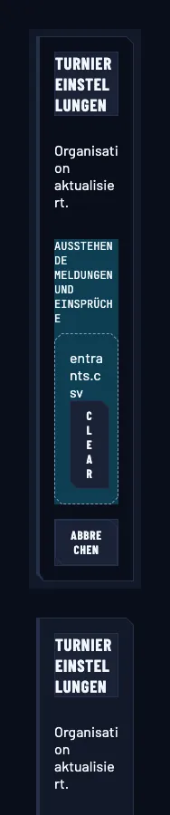

# Owned controls and story coverage — 0222 follow-up

## Scope

This follow-up completes the review decisions made after PR #248: recursive story discovery across
React surfaces, different selected and chrome fills, an explicit broadcast nesting cap, and TV
preview backgrounds. Existing Checkbox, Radio, Select and FilePicker adoption remains in place.

The story gate walks `apps/web/src`, including nested operator/public/TV components and `control/i18n`.
Library tiers are recursive too. Router/provider/deferred exceptions use source paths, so an
exception cannot hide a same-named component elsewhere. The expanded inventory found no additional
missing stories. Astro remains outside the React story gate.

## Surface decisions

Neutral chrome retains ink-850 (`#1A2236`). Selection uses opaque cyan-950 (`#0E3E53`) through
`surface-raised`, with the existing selection border and filename/state cue. Ordinary buttons,
inputs, headers, table chrome and passive panels now reference `surface-chrome`, preserving their
previous fill. The active TV rail tab receives the selected fill.

The reference project's `ExplainableStandingsDemo.astro` and `AuditedResultsDemo.astro` informed the
separation between neutral framing and emphasized content. The application keeps its own component
and semantic-token contracts. `Admin/Atoms/Card/AlternationAndChrome` compares real FilePicker
selection with header/footer chrome and ordinary content on both bands; clearing one selection
returns only that picker to its default fill.

Operator/public content continues alternating across nested cards and wells. Broadcast content uses
the panel level after its first step from the base, with borders separating deeper containers.
Headers, selection and other state treatments keep their independent roles.

## Local browser review

Reviewed on 2026-09-10 in Chromium using the local Storybook server and current generated tokens.
The bounded inspection covered desktop (1440 × 900), TV phone portrait (374 × 760), and German
surface comparison at the 188px zoom floor. The initial narrow comparison overflowed; applying
the existing standalone control containment and responsive band padding removed horizontal overflow
(188px viewport and document width in confirmation). Text still wraps heavily at this extreme width.

| Example/control                   | Observed result                                                                                                                                                |
| --------------------------------- | -------------------------------------------------------------------------------------------------------------------------------------------------------------- |
| Neutral lower third               | Existing dark preview canvas remains available.                                                                                                                |
| Green chroma                      | Pure green shows through the transparent stage; score panels remain opaque.                                                                                    |
| Bright football / dark basketball | Both bundled venue images remain visible around the readable lower third.                                                                                      |
| Kiosk over football               | Production opaque kiosk panels cover the backdrop.                                                                                                             |
| Keyboard background change        | Selecting the basketball option with End/Enter changes only the backdrop; displayed teams and 2:1 score persist.                                               |
| Language and viewport toolbar     | Selecting German and entering 374px preserves the chroma backdrop. German card copy also renders from the actual catalogue.                                    |
| Selected FilePicker               | Chrome resolves to `rgb(26, 34, 54)`, selected fill to `rgb(14, 62, 83)` on both bands; filename and border remain visible. Clear removes only that selection. |

Existing FilePicker prompt/Clear text and some TV fixture labels do not follow every catalogue
selection. This review exposes that existing limitation; it does not claim complete translation
coverage or real-device testing.

TV assets are bundled, generated illustrative venues with provenance in
[`apps/web/.storybook/assets/README.md`](../../apps/web/.storybook/assets/README.md).
Background choice is preview-only and does not change discipline, match data, layout mode or
production chroma configuration. There is no hosted Storybook build or screenshot-diff service.

## Verification

- Root unit suite: 307 suites / 4,305 tests passed; lint and typecheck passed.
- Web coverage: 114 suites / 1,407 tests; 85.29% branches, above the 85% threshold.
- Design-token coverage: 125 tests; 90.38% branches. Text, border and focus contrast checks pass.
- Ownership scanner: zero violations; all 35 scanner tests pass.
- Web integration: static help build/verification passed (1 suite / 1 test).
- Focused brand-parity browser tests: 6 passed, including computed three-level surface assertions.
- Full E2E: 225 passed with five workers. An earlier run had two transient platform-help failures;
  the focused 19-test help suite and the isolated full rerun passed. Cause was not established.
- Strict OpenSpec validation passes. Existing CI wiring runs scanner/tests in
  `enterprise-readiness-doc-lint`, affected coverage in `unit-tests-group` and browser assertions in
  `e2e-tests-shard`; aggregate checks retain their existing names.

## Review captures

These captures document local review, not pixel baselines.

