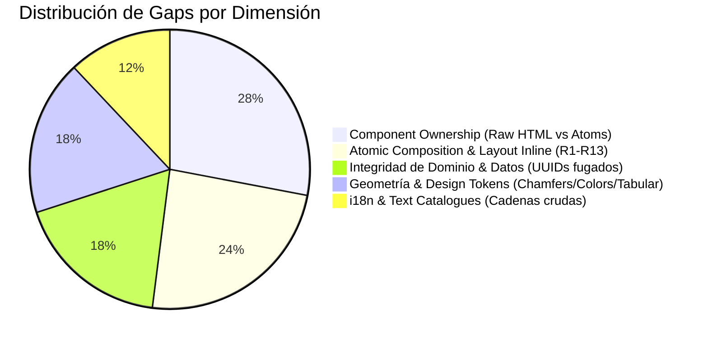

# Matriz Consolidada de Gaps e Impacto de Auditoría — CopaLibre (0280–0294)

## 1. Alcance y Metodología del Barrido

Esta matriz consolida la auditoría end-to-end de diseño, estilo, UX y composición atómica realizada sobre las **15 superficies** de CopaLibre:
* **10 Pantallas Operacionales de Gestión y Torneo** (`/control/[org]/...`)
* **1 Consola de Operación en Vivo de Partidos** (`/control/.../matches/[id]`)
* **1 Flujo Transaccional de Creación** (Tournament Creation Wizard)
* **1 Componente Modal Suspendido** (`ImageCropModal`)
* **1 Superficie Pública de Consulta** (Astro SSR sin JS)
* **1 Superficie de Transmisión TV / Broadcast Kiosk** (Full-Bleed 1080p)

Cada superficie fue ejecutada localmente con datos reales del torneo (`copa-test` / `torneo-apertura-2026`), capturada con herramientas de automatización, contrastada contra el Design System normativo (`DESIGN.md`, `.impeccable/`, `packages/design-tokens`) y validada en Stitch.

---

## 2. Matriz Consolidada de Gaps

| ID Cambio OpenSpec | Superficie / Ruta | Gap Visual / UX (Stitch vs DESIGN.md) | Gap de Código / Atomic Composition | Fuga de Dominio / Integridad de Datos | Impacto y Acción Requerida |
| :--- | :--- | :--- | :--- | :--- | :--- |
| **0280** | **Dashboard Org** (`/control/copa-test`) | Falta de jerarquía en cards de estadísticas rápidas; badges sin contraste formal. | Clases manuales `.cl-card` y `<button>` crudos sin componente `<Button>`. | Ninguna detectada. | Refactorizar a átomos `<Card>` y `<Badge>` poseídos; actualizar `KNOWN_HANDWRITTEN_CLASSES`. |
| **0281** | **Live Match Console** (`/matches/[id]`) | Botones de eventos no aplicaban chamfer asimétrico de control (`.cl-chamfer--control`). | Controles de cronómetro con estilos inline; falta de `tabular-nums` explícito. | Eventos registran tipos fijos en vez de leer del `DisciplineDescriptor`. | Asegurar que los botones de acción rápida lean eventos desde la disciplina activa. |
| **0282** | **Seeding & Bracket** (`/stages/1/seeding`) | Tarjetas de cruces con esquinas redondeadas genéricas en vez de chaflanes diagonales. | Elementos interactivos sin atributo de foco accesible en SVG canvas. | **CRÍTICO**: Los atletas/equipos renderizan UUIDs opacos (`01a0ac...`) en vez de nombres. | Exponer `resolveEntrantNames` en el endpoint de seeding para resolver nombres reales. |
| **0283** | **Zones & Groups** (`/stages/1/zones`) | Tablas de grupos sin alternancia de filas opacas (`ink-930` / `ink-940`). | Etiquetas `<label>` crudas y falta de `<Inline>` para agrupar badges. | **ALTO**: `GroupResponse` no lista los IDs ni nombres de los participantes del grupo. | Extender `CompetitionRepository` y DTO de wire para incluir `entrantIds` en cada grupo. |
| **0284** | **Zone Promotion Plan** (`/promotion`) | Alertas de reglas de desempate usan texto pequeño sin acompañamiento no-cromático. | Violación de `KNOWN_LITERAL_TEXT`: Cadenas en inglés quemadas en la plantilla. | Ninguna detectada. | Migrar cadenas a `messages.en.ts` / `messages.es.ts` y componer con `<InlineAlert>`. |
| **0285** | **Tournament Settings** (`/settings`) | Input de subida de escudo se dibuja como botón estándar sin zona drop. | Uso de `<input type="file">` crudo en vez de `<FilePicker>`; textos duros en reglas. | Falta de validación reactiva de mutaciones prohibidas durante torneo en curso. | Adoptar átomo `<FilePicker>` poseído y traducir reglas a lenguaje llano. |
| **0286** | **Roles & Permissions** (`/roles`) | Asignación de roles no destaca el rol activo con Signal Cyan (`#00D4FF`). | Formularios de invitación usan `<select>` y `<input>` HTML nativos. | Asignación de permisos no valida scopes jerárquicos en cliente. | Reemplazar por átomos `<Select>` e `<Input>`; actualizar `KNOWN_RAW_ELEMENTS`. |
| **0287** | **Venues & Officials** (`/resources`) | Lista de canchas y árbitros sin separación estructural de hairlines `ink-700`. | **DEUDA SEVERA**: 11 etiquetas `<label>` HTML crudas registradas en `KNOWN_RAW_ELEMENTS`. | Ninguna detectada. | Erradicar las 11 etiquetas `<label>` adoptando la molécula `<FormRow>` y `<Label>`. |
| **0288** | **Org Preferences** (`/organization`) | Falta de contraste en botones secundarios de rotación de tokens PAT. | Textos de preferencias usan claves no traducidas (`preferences.*`). | Ninguna detectada. | Proveer descriptores i18n canónicos para todas las configuraciones organizacionales. |
| **0289** | **Cryptographic Audit** (`/audit-trail`) | Badges de hash criptográfico truncan valores sin tooltip o affordance de copia. | Tabla de eventos viola R3 por estilo inline en columna de verificación de firma. | **MEDIO**: Los actores del log se muestran como UUIDs crudos sin email/nombre. | Resolver alias/email de los actores que firman transacciones criptográficas. |
| **0290** | **Analytics Dashboard** (`/analytics`) | Grids con gaps inconsistentes que no respetan la escala de 4px (`16px`/`24px`). | **DEUDA SEVERA**: 5 violaciones de layout inline y 1 valor de estilo crudo en `AnalyticsTemplate`. | Omisión de métricas de partidos por estado (live/upcoming/concluido). | Eliminar estilos inline, adoptar `ListScreenLayout` y reducir deuda en scripts de CI. |
| **0291** | **Tournament Wizard** (`/tournaments/new`) | Badges de paso (`StepBadge`) no aplican chamfer asimétrico diagonal (`.cl-chamfer--control`). | **BLOQUEANTE EN DEV**: Proxy de Vite en `astro.config.mjs` no reenviaba `/disciplines`. | Ninguna detectada. | Incorporar rutas proxy fijas en `astro.config.mjs` y chaflanes en `WizardShell`. |
| **0292** | **Image Crop Modal** (`ImageCropModal`) | Contenedor de recorte con marco cuadrado genérico sin styling de diseño. | Violación de regla R3: `cropAreaStyle` define estilos inline dentro del modal. | Ninguna detectada. | Adoptar clase de token `.cl-image-frame` (4:5) y preservar sombra suspendida. |
| **0293** | **Public Tournament** (`/[org]/tournaments/[t]`) | Columnas numéricas de tablas de posiciones sin monoespaciado numérico forzado. | Tablas no declaran `.cl-tabular-nums`, causando desalineación de columnas en móvil. | Ninguna detectada. | Incorporar `.cl-tabular-nums` y verificar alternancia de bandas (*Alternating Band Rule*). |
| **0294** | **TV Broadcast View** (`/tv/...`) | Indicadores de penalizaciones y posesión caen por debajo de ratio 4.5:1 en estadios. | Tarjetas de cruces en TV no implementan biselado `square bevel square bevel`. | Ninguna detectada. | Añadir respaldos opacos `ink-950` y aplicar chaflanes diagonales a tarjetas de TV. |

---

## 3. Clasificación de Gaps por Dimensión Técnica



### A. Dimensión 1: Integridad de Dominio y Fuga de UUIDs (Impacto Crítico)
* **Problema**: En `SeedingBuilderTemplate` (`0282`), `ZoneGroupTemplate` (`0283`) y `AuditTrailTemplate` (`0289`), la interfaz expone UUIDs opacos a los operadores de mesa y coordinadores de torneo.
* **Causa Raíz**: Los repositorios (`CompetitionRepository`, `EnrollmentRepository`) retornaban IDs sin hidratar las entidades relacionadas (nombres de equipos, personas o emails de actores).
* **Solución**: Hidratación en backend o batch query de resolución en el controlador correspondiente.

### B. Dimensión 2: Ownership de Componentes (`scripts/check-ui-ownership.mjs`)
* **Problema**: Presencia de elementos nativos `<label>`, `<button>`, `<select>`, `<input type="file">` y clases `.cl-card` escritas a mano.
* **Puntos Críticos**:
  * `VenueManagementTemplate` acumula **11 etiquetas `<label>`**.
  * `TournamentSettingsTemplate` utiliza `<input type="file">` crudo en lugar de `<FilePicker>`.
  * `RolesManagementTemplate` utiliza `<select>` nativo.
* **Solución**: Reemplazo directo por átomos de `@copalibre/ui` y reducción de los contadores en `KNOWN_RAW_ELEMENTS` y `KNOWN_HANDWRITTEN_CLASSES`.

### C. Dimensión 3: Composición Atómica y Layout (`scripts/check-atomic-composition.mjs`)
* **Problema**: Inyecciones de estilos inline con propiedades de layout (`display: grid`, `flexDirection`, `fontSize`) debajo del tier Template.
* **Puntos Críticos**:
  * `AnalyticsTemplate.tsx` (5 violaciones de inline layout y 1 de raw style value).
  * `ImageCropModal.tsx` (`cropAreaStyle` inline).
* **Solución**: Reemplazo por layouts canónicos (`ListScreenLayout`, `Grid`, `.cl-image-frame`).

### D. Dimensión 4: Tokens de Geometría y Sistema de Señales (`DESIGN.md`)
* **Geometría de Chaflán**:
  * Adopción de la especificación limpia:
    ```css
    border-radius: 0 var(--cl-chamfer-size) 0 var(--cl-chamfer-size);
    corner-shape: square bevel square bevel;
    ```
  * Cero utilización de `clip-path` en producción para proteger los halos de foco y sombras estructurales.
* **Separación Cromática**:
  * Señal única: Cyan `#00D4FF` (foco/acción).
  * Atención: Ámbar `#FF9C1E` (próximos).
  * Confirmación: Verde `#22C55E` (resultados).
  * Disputa: Rojo `#EF4444` (disputas/errores).
  * Cada color **siempre emparejado** con etiqueta textual o ícono.

---

## 4. Hoja de Ruta de Implementación (Fase 4: Ejecución en Lotes)

Para mitigar el riesgo de integración y asegurar que los checks de CI pasen en cada paso, las 15 propuestas se agrupan en 3 batches secuenciales:

```
┌─────────────────────────────────────────────────────────────────────────┐
│ BATCH 1: Integridad de Dominio y Datos (Backend + Controllers + Wire)   │
│ • 0282: Resolución de nombres de atletas/equipos en Brackets            │
│ • 0283: Exposición de equipos asignados a Grupos/Zonas                  │
│ • 0289: Resolución de nombres/emails en Audit Trail                     │
└────────────────────────────────────┬────────────────────────────────────┘
                                     │
                                     ▼
┌─────────────────────────────────────────────────────────────────────────┐
│ BATCH 2: Component Ownership & Erradicación de Deuda Raw HTML           │
│ • 0287: Reemplazo de 11 <label> en Venues & Officials                   │
│ • 0285: Adopción de <FilePicker> y reglas en lenguaje llano             │
│ • 0286: Reemplazo de <select> e <input> en Roles & Permissions          │
│ • 0292: Adopción de .cl-image-frame en ImageCropModal                   │
└────────────────────────────────────┬────────────────────────────────────┘
                                     │
                                     ▼
┌─────────────────────────────────────────────────────────────────────────┐
│ BATCH 3: Templates, Tokens, i18n y Superficies Públicas/TV              │
│ • 0280 & 0288: Dashboard y Preferences (Cards, i18n descriptors)        │
│ • 0284: Zone Promotion Plan (Alertas y textos i18n)                     │
│ • 0290: Analytics Dashboard (Eliminar inline styles, ListScreenLayout)  │
│ • 0291: Wizard de Torneo (Proxy fijo y chaflanes en WizardShell)        │
│ • 0293 & 0294: Tabular nums en Público y High-Contrast Wells en TV      │
└─────────────────────────────────────────────────────────────────────────┘
```
